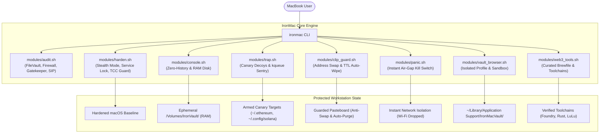

# 🛡️ IronMac

> **Hardened Web3 & Crypto Workstation for macOS.**  
> Defend against macOS infostealers (AMOS), eliminate plaintext shell history key leaks, deploy active canary honeypots, and isolate high-value transaction signing into auditable clean-room environments.

[](LICENSE)
[]()
[]()
[]()
[](https://github.com/0xaicrypto/ironmac/pulls)

---

## 📑 Table of Contents

- [Why IronMac?](#-why-ironmac)
- [Threat Model & Security Matrix](#-threat-model--security-matrix)
- [Key Features](#-key-features)
- [Typical Use Cases & Walkthroughs](#-typical-use-cases--walkthroughs)
  - [1. Ephemeral "Burner" Wallets](#1--ephemeral-burner-wallets-airdrops--testnet-testing)
  - [2. Daily Surfing vs. DeFi Signing (Anti-AMOS)](#2-️-segregating-daily-surfing-from-defi-signing-anti-amos-stealer)
  - [3. Offline Cold Signing for Whales & Multi-Sig](#3--offline-cold-signing-whales--multi-sig-signers)
  - [4. Public Wi-Fi & Conference Hardening](#4--public-wi-fi--crypto-conference-defense)
  - [5. Active Anti-AMOS Honeypot Tripwire](#5--active-anti-amos-honeypot-tripwire-early-warning-alarm)
  - [6. Clipboard Protection & Key Auto-Purge](#6--clipboard-protection--30-second-key-auto-purge)
  - [7. Emergency Air-Gap Panic Protocol](#7--emergency-air-gap-panic-protocol)
- [Vault Browser vs. Vault Console: Key Differences](#-architectural-distinction-vault-browser-vs-vault-console)
- [Quick Start & Installation](#-quick-start--installation)
- [Command Reference](#-command-reference)
- [System Architecture](#-system-architecture)
- [Security & Responsible Disclosure](#-security--responsible-disclosure)
- [License](#-license)

---

## 🎯 Why IronMac?

MacBooks are the undisputed hardware of choice for Web3 founders, smart contract engineers, and cryptocurrency traders. However, **default macOS configurations leave critical security vulnerabilities for digital assets**:

- **The Surge of macOS Infostealers (e.g., AMOS / Atomic Stealer):** Malicious `.dmg` and `.pkg` installers (distributed via fake Calendly links, Zoom updates, or compromised job interview tests) systematically harvest browser extension storage (`~/Library/Application Support/...`) to exfiltrate MetaMask, Phantom, and session credentials.
- **Plaintext Terminal History Leaks:** Running `cast wallet import --private-key 0x...`, setting `export PRIVATE_KEY=...`, or generating keypairs permanently commits raw private keys to `~/.zsh_history` in plaintext.
- **Unhardened Network Defaults:** Standard macOS leaves the Application Firewall off, stealth mode disabled, and remote Apple Events available on local networks.
- **Browser Extension Cross-Contamination:** Mixing daily web surfing (social media, untrusted downloads, translation extensions) with high-value DeFi signing exposes wallet extension RPC providers to malicious injection.

**IronMac solves these vectors through a 100% open-source, auditable hardening toolkit and intrusion prevention suite that transforms your MacBook into a dedicated crypto fortress.**

---

## 🛡️ Threat Model & Security Matrix

| Attack Vector / Threat | macOS Default State | IronMac Defense Mechanism |
| :--- | :--- | :--- |
| **AMOS Infostealers** (Fake meeting payloads) | Extension vaults reside in standard hardcoded paths | Physical segregation to `~/Library/.../IronMacVault` + Canary decoys |
| **Shell History Key Harvesting** | Commands logged to disk in `~/.zsh_history` | Ephemeral RAM console with `HISTFILE=/dev/null` (`ironmac console`) |
| **Public Wi-Fi Inbound Probing** | Firewall & Stealth mode disabled | Automated baseline hardening (`socketfilterfw`) |
| **Browser Extension Snooping** | All extensions share browser process privileges | Clean-room browser profile strictly reserved for verified DApps |
| **SSD Artifact Residue** | Private keys and scratch files written to APFS | Volatile 32MB RAM Disk auto-purged on session termination |
| **Background Key Directory Scraping** | Silent unauthorized access to keystores | Zero-CPU `kqueue` tripwire sentry firing immediate desktop alarms |
| **Clipboard Address Substitution** | Any background app can overwrite pasteboard | Real-time address swap detector (`ironmac clip-guard`) |
| **Lingering Private Keys in Clipboard** | Sensitive keys retained in memory indefinitely | 30-second TTL auto-purge for private keys & seed phrases |
| **Accidental Malware / Phishing Execution** | Malware connects outbound to exfiltrate keys | Instant hardware air-gap Panic Button (`ironmac panic`) |

---

## ✨ Key Features

- **🔍 Security Health Audit:** Scans your system's FileVault encryption, SIP, Gatekeeper, Application Firewall, and remote sharing services with an instant risk score.
- **🔒 Automated Baseline Hardening:** One-click enables stealth mode, drops unsolicited ICMP pings, closes unauthenticated ports, and restricts remote automation.
- **💻 Zero-Trace Vault Console:** Spawns an ephemeral, RAM-backed terminal session (`/Volumes/IronVault`) featuring a cyberpunk telemetry HUD, two-line tactical prompt, and shell history completely disabled (`HISTFILE=/dev/null`). Includes built-in `shred`, `keccak`, `wei2eth`, and offline wallet tooling. All commands and scratch files vanish from memory upon exit.
- **🪙 Built-in EVM & Starknet CLI Wallets:** Instant, zero-trace wallet generation and transaction signing using Foundry's `cast` (EVM) and `starkli` (Starknet) directly inside the ephemeral RAM Disk.
- **🪤 Active Anti-AMOS Honeypot Trap:** Deploys decoy canary keystores in standard infostealer targets (`~/.ethereum/keystore`, `~/.config/solana`, Documents) and runs a zero-CPU `kqueue` sentry daemon that immediately fires audio & desktop alarms when untrusted processes tamper with them.
- **📋 Clipboard Guard:** Detects silent address swapping trojans (EVM, Solana, Bitcoin) and automatically purges copied private keys and seed phrases after a 30-second TTL.
- **🚨 Emergency Air-Gap Panic Button:** Instant kill switch (`ironmac panic`) that powers off Wi-Fi, purges the clipboard, and shuts down all browsers and communication apps during suspected malware execution.
- **🌐 Isolated "Vault" Browser Profile:** Spawns a hardened, telemetry-free Brave/Chrome profile stored in an isolated directory specifically dedicated to wallet extensions and DeFi transactions.
- **📦 Curated Web3 Toolchain (via Brewfile):** Installs verified developer toolchains (Foundry, Rust, Solana CLI, Docker/OrbStack) and security utilities (LuLu firewall, hardware wallet tools) safely.
- **💯 Zero-Trust & Zero Binaries:** Every line is written in transparent, clean Shell/Homebrew scripts. No black-box binaries, no telemetry, no tracking.

---

## 💡 Typical Use Cases & Walkthroughs

### 1. 🪙 Ephemeral "Burner" Wallets (Airdrops & Testnet Testing)
* **The Risk:** Interacting with new testnets, meme tokens, or claiming airdrops often requires generating quick burner keys. Doing this normally leaves raw private keys in text files and permanently logged in `~/.zsh_history`.
* **The IronMac Way:**
  ```bash
  # 1. Spawn a zero-trace memory workspace
  ironmac console

  # 2. Inside the secure console, view built-in commands or live telemetry HUD:
  help   # (or 'iron-help')
  hud    # (live RAM disk, honeypot & air-gap status)

  # 3. Generate an ephemeral EVM burner wallet directly in RAM
  cast wallet new
  # -> Outputs Address, Private Key, Mnemonic directly in RAM
  # -> Automatically displays tactical Key Custody Protocol & safety rules!

  # 4. Or review the comprehensive custody playbook anytime:
  key-guide

  # 5. Or generate a Starknet signer keystore inside the RAM disk
  starkli signer create ./signer.json

  # 6. Perform your testnet claims or transfers, then simply exit:
  exit
  # -> Ephemeral RAM Disk is ejected & erased.
  # -> Zero private keys or commands ever touched your SSD or ~/.zsh_history.
  ```

### 2. 🛡️ Segregating "Daily Surfing" from "DeFi Signing" (Anti-AMOS Stealer)
* **The Risk:** You click a fake Zoom, Calendly, or game-test link on Telegram/Discord. An infostealer (like AMOS) executes and immediately dumps your default Chrome profile where MetaMask or Phantom lives.
* **The IronMac Way:**
  ```bash
  # 1. Initialize your isolated Vault Browser profile
  ironmac vault-browser

  # 2. Launch your clean-room trading browser anytime:
  ironmac-vault-browser
  # -> Runs with an isolated data directory: ~/Library/Application Support/IronMacVault/Profile
  # -> Install only MetaMask/Rabby with zero untrusted extensions
  # -> Complete physical separation from daily web surfing and malicious downloads
  ```

  > [!NOTE]
  > **Will my wallet extensions (MetaMask, Rabby) stay saved?**  
  > **Yes, absolutely.** Unlike the ephemeral Vault Console, the Vault Browser is **persistent**. All installed wallet extensions, custom RPCs, and encrypted keystores are securely stored in your dedicated `~/Library/Application Support/IronMacVault/Profile` directory. You do **NOT** need to re-import your seed phrase every time—simply launch `ironmac-vault-browser` and unlock your wallet with your password as usual.

### 3. ❄️ Offline Cold Signing (Whales & Multi-Sig Signers)
* **The Risk:** Signing multi-sig transactions or large transfers on an unhardened, internet-connected machine exposes your keys to memory-scraping malware or clipboard address substitution.
* **The IronMac Way:**
  ```bash
  # 1. Launch the zero-trace console
  ironmac console

  # 2. Cut Wi-Fi instantly using the built-in air-gap switch
  airgap on
  # -> Wi-Fi (en0) powered off. System physically isolated.

  # 3. Sign transaction data completely offline
  cast wallet sign --data "0x8f3c..." --interactive
  # -> Generates raw cryptographic signature hex string in RAM

  # 4. Restore Wi-Fi and set RPC to broadcast
  airgap off
  rpc eth
  cast publish <signed_tx_hex>

  # 5. Exit to destroy private key session from memory
  exit
  ```

### 4. ☕ Public Wi-Fi & Crypto Conference Defense
* **The Risk:** Airport Wi-Fi and hacker-heavy crypto conferences (Devcon, EthCC, Token2049) are hotbeds for automated port scanning, rogue DNS responder attacks, and local network probes.
* **The IronMac Way:**
  ```bash
  # 1. Audit your current Mac posture in 5 seconds
  ironmac audit

  # 2. Apply stealth baseline (drops ICMP pings, blocks inbound scans, shuts remote ports)
  ironmac harden
  ```

### 5. 🪤 Active Anti-AMOS Honeypot Tripwire (Early Warning Alarm)
* **The Risk:** A disguised `.pkg` or phishing malware executes in background and starts scanning your system directories for Ethereum keystores or Solana keypairs.
* **The IronMac Way:**
  ```bash
  # 1. Arm canary wallet decoys and start the background kqueue sentry
  ironmac trap start

  # 2. Check armed status and active decoy targets
  ironmac trap status
  # -> ARMED: ~/.ethereum/keystore/UTC--canary-ironmac-trap.json
  # -> ARMED: ~/.config/solana/id.json
  # -> ARMED: ~/Documents/.ironmac_canary/wallet_backup_do_not_share.txt

  # 3. Simulate a test probe to verify desktop alert & alarm sound
  ironmac trap test
  # -> Instant macOS desktop notification: "🚨 IronMac Honeypot Triggered!"
  ```

### 6. 📋 Clipboard Protection & 30-Second Key Auto-Purge
* **The Risk:** You copy a private key or 12-word seed phrase to import it into a wallet. It remains in your macOS clipboard indefinitely, readable by any background app or telemetry script. Additionally, clipboard malware can swap copied `0x...` addresses with attacker addresses.
* **The IronMac Way:**
  ```bash
  # 1. Start the Clipboard Guard daemon
  ironmac clip-guard start

  # 2. When an EVM, Solana, or BTC address is copied, IronMac verifies integrity.
  # If a rapid address swap occurs, an alarm sounds and the intrusion is logged.

  # 3. When a private key or mnemonic is copied, IronMac initiates a 30-second TTL:
  # -> Desktop alert: "⚠️ Private key detected. Auto-wiping in 30s."
  # -> After 30 seconds: Pasteboard is automatically wiped without human intervention.
  ```

### 7. 🚨 Emergency Air-Gap Panic Protocol
* **The Risk:** You accidentally ran a suspicious script, opened a fake `.pkg` installer, or suspect an active remote access trojan on your machine.
* **The IronMac Way:**
  ```bash
  # Trigger immediate emergency air-gap
  ironmac panic

  # In < 1 second:
  # -> Powers off Wi-Fi hardware interface (en0)
  # -> Terminates all browsers (Chrome, Brave, Safari) and chat apps (Telegram, Discord, Slack)
  # -> Wipes pasteboard memory to prevent clipboard exfiltration
  # -> Locks the screen

  # When the threat is contained, restore connectivity:
  ironmac panic restore
  ```

---

## ⚖️ Architectural Distinction: Vault Browser vs. Vault Console

| Feature | 🌐 Vault Browser (`ironmac-vault-browser`) | 💻 Vault Console (`ironmac console`) |
| :--- | :--- | :--- |
| **Data Lifecycle** | **Persistent** (Stored in `~/Library/.../IronMacVault`) | **Ephemeral** (Pure RAM Disk, auto-wiped on exit) |
| **Wallet State** | **Persistent** (MetaMask & accounts stay saved) | **Non-Persistent** (Zero trace, vanishes upon `exit`) |
| **Primary Use Case** | Daily high-value DeFi trading & portfolio management | Burner airdrop claims, testnet testing & offline cold signing |
| **Protection Focus** | Bypasses AMOS stealer paths, prevents extension pollution | Prevents `~/.zsh_history` plaintext key leaks & SSD residue |

---

## 🚀 Quick Start & Installation

### Option 1: One-Line Guided Install & Audit (Recommended)

Run the verified installer directly via curl:

```bash
curl -fsSL https://raw.githubusercontent.com/0xaicrypto/ironmac/main/install.sh | bash
```

> [!TIP]
> **Audit Before Running:** You can inspect the installer code prior to execution by running:  
> `curl -fsSL https://raw.githubusercontent.com/0xaicrypto/ironmac/main/install.sh | less`

### Option 2: Clone and Run Locally

```bash
git clone https://github.com/0xaicrypto/ironmac.git
cd ironmac
chmod +x ./bin/ironmac
./bin/ironmac
```

---

## 💻 Command Reference

```text
=====================================================
            🛡️ IronMac - Web3 Workstation CLI
=====================================================

Usage: ironmac <command> [options]

Commands:
  audit          Run a comprehensive security audit of your Mac
  harden         Apply recommended security baselines and network stealth
  vault-browser  Launch or configure the isolated Web3 wallet browser profile
  console        Launch a zero-trace, ephemeral RAM-backed secure terminal
  trap           Anti-AMOS honeypot decoys & tripwire sentry [start|stop|status|test]
  clip-guard     Clipboard address swap detector & 30s key auto-wipe [start|stop|status|clear|test]
  panic          Emergency air-gap: instant Wi-Fi shutdown & threat isolation [trigger|restore]
  tools          Interactive installer for curated Web3 developer & trader tools
  all            Run the complete guided setup wizard
  version        Print IronMac version
  help           Display this help message
```

---

## 🏗️ System Architecture



---

## 🛡️ Security & Responsible Disclosure

IronMac adheres to a strict **"Don't Trust, Verify"** philosophy:

1. **No Compiled Binaries:** IronMac core comprises 100% readable, transparent Bash and Python scripts. You can audit every single line.
2. **Non-Destructive Operations:** IronMac does not disable core macOS services (like iCloud or Xcode) and operates strictly within standard user/system boundaries.
3. **Reporting Security Issues:** If you identify any security issue or vulnerability in IronMac, please report it via [GitHub Security Advisories](https://github.com/0xaicrypto/ironmac/security/advisories) or by opening a confidential issue.

---

## 🤝 Contributing

Contributions are welcome! Please feel free to submit a Pull Request or open an Issue for new security recommendations, tool integrations, or platform improvements.

---

## ⚖️ License

Distributed under the [MIT License](LICENSE). Copyright (c) 2026 0xaicrypto.
