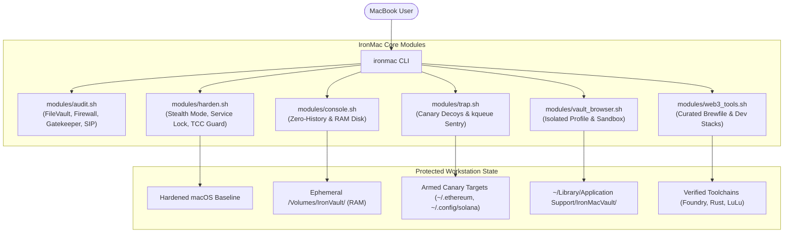

# 🛡️ IronMac

> **Turn your MacBook into an ironclad, audit-ready Web3 & Crypto workstation in minutes.**

[](LICENSE)
[]()
[]()
[]()

---

## 🎯 Why IronMac?

MacBooks are the undisputed hardware of choice for Web3 founders, developers, and crypto traders. However, **default macOS settings leave critical security gaps for crypto assets**:

- **The Rise of macOS Infostealers (e.g., AMOS / Atomic Stealer):** Malicious `.dmg` or `.pkg` files (disguised as fake Calendly links, Zoom updates, or Web3 game tests) silently harvest MetaMask, Phantom, and browser session cookies from `~/Library/Application Support/...`.
- **Plaintext Terminal History Leaks:** Running `cast wallet import --private-key 0x...`, export statements, or mnemonic flags permanently writes your sensitive keys into `~/.zsh_history` in plaintext, which stealers immediately harvest.
- **Unhardened Network Defaults:** Standard macOS often leaves remote login, AirDrop discovery, and local port responses wide open on public Wi-Fi.
- **Shared Browser Pollution:** Mixing daily web browsing (social media, random links, suspicious extensions) with high-value DeFi signing and cold storage bridging is a recipe for disaster.
- **Fragmented Web3 Tooling:** Installing and verifying Foundry, Rust, Solana CLI, Docker, and hardware wallet bridges manually often leads to dependency conflicts or typo-squatted malicious packages.

**IronMac solves this through a 100% auditable, open-source hardening toolkit that transforms your MacBook into a dedicated, fortress-grade crypto workstation.**

---

## ✨ Key Features

- **🔍 Security Health Audit:** Scans your system's FileVault encryption, SIP, Gatekeeper, Application Firewall, and remote sharing services with a clear risk score.
- **🔒 One-Click Baseline Hardening:** Enables stealth mode, closes unauthenticated ports, blocks unverified remote execution, and configures secure DNS-over-HTTPS.
- **💻 Zero-Trace Vault Console:** Launches an ephemeral, RAM-backed terminal session (`/Volumes/IronVault`) with shell history completely disabled (`HISTFILE=/dev/null`). All commands and scratch files disappear from memory upon exit.
- **🪙 Built-in EVM & Starknet CLI Wallets:** Instant, zero-trace wallet generation and transaction signing using Foundry's `cast` (EVM) and `starkli` (Starknet) directly inside the ephemeral RAM Disk.
- **🪤 Active Anti-AMOS Honeypot Trap:** Deploys decoy canary keystores in standard infostealer search targets (`~/.ethereum/keystore`, `~/.config/solana`, Documents) and runs a zero-CPU `kqueue` sentry daemon that immediately fires audio & desktop alarms when untrusted processes tamper with them.
- **🌐 Isolated "Vault" Browser Profile:** Spawns a hardened, telemetry-free Brave/Chrome profile stored in an isolated directory specifically dedicated to wallet extensions and DeFi transactions.
- **📦 Curated Web3 Stack (via Brewfile):** Installs verified developer toolchains (Foundry, Rust, Solana CLI, Docker/OrbStack) and security utilities (LuLu firewall, hardware wallet tools) safely.
- **💯 Zero-Trust & Zero Binaries:** Every line is written in transparent, clean Shell/Homebrew scripts. No black-box binaries, no telemetry, no tracking.

---

## 💡 Typical Use Cases & Examples

### 1. 🪙 Ephemeral "Burner" Wallets (Airdrops & Testnet Testing)
* **The Risk:** Interacting with new testnets, meme tokens, or claiming airdrops often requires generating quick burner keys. Doing this normally leaves raw private keys in text files and permanently logged in `~/.zsh_history`.
* **The IronMac Way:**
  ```bash
  # 1. Spawn a zero-trace memory workspace
  ironmac console

  # 2. Inside the secure console, generate an ephemeral EVM burner wallet
  cast wallet new
  # -> Outputs Address, Private Key, Mnemonic directly in RAM

  # 3. Or generate a Starknet signer keystore inside the RAM disk
  starkli signer create ./signer.json

  # 4. Perform your testnet claims or transfers, then simply exit:
  exit
  # -> Ephemeral RAM Disk is ejected & erased.
  # -> Zero private keys or commands ever touched your SSD or ~/.zsh_history.
  ```

### 2. 🛡️ Segregating "Daily Surfing" from "DeFi Signing" (Anti-AMOS Stealer)
* **The Risk:** You click a fake Zoom, Calendly, or game-test link on Telegram/Discord. An infostealer (like AMOS) executes and immediately dumps your default Chrome profile where MetaMask or Phantom lives.
* **The IronMac Way:**
  ```bash
  # 1. Initialize your isolated Vault Browser profile
  ironmac vault-browser

  # 2. Launch your clean-room trading browser anytime:
  ironmac-vault-browser
  # -> Runs with an isolated data directory: ~/Library/Application Support/IronMacVault/Profile
  # -> Install only MetaMask/Rabby with zero untrusted extensions
  # -> Complete physical separation from daily web surfing and malicious downloads
  ```

  > **❓ Will my wallet extensions (MetaMask, Rabby) stay saved?**  
  > **Yes, absolutely.** Unlike the ephemeral Vault Console, the Vault Browser is **persistent**. All installed wallet extensions, custom RPCs, and encrypted keystores are securely stored in your dedicated `~/Library/Application Support/IronMacVault/Profile` directory. You do **NOT** need to re-import your seed phrase every time—simply launch `ironmac-vault-browser` and unlock your wallet with your password as usual.
  >
  > **Why is this safer than standard Chrome/Brave?**  
  > 1. **Bypasses Hardcoded Malware Scans:** Infostealers (like AMOS) hardcode default search paths (`~/Library/Application Support/Google/Chrome/Default/...`). They do not inspect IronMac's custom vault directory.  
  > 2. **Zero Extension Pollution:** Free from daily translation tools, downloaders, and unverified plugins that could leak session keys.  
  > 3. **Clean-Room Surfing:** Only open verified DApps (Uniswap, Aave, Staking portals), strictly separate from social media surfing.

### 3. ❄️ Offline Cold Signing (Whales & Multi-Sig Signers)
* **The Risk:** Signing multi-sig transactions or large transfers on an unhardened, internet-connected machine exposes your keys to memory-scraping malware or clipboard address substitution.
* **The IronMac Way:**
  ```bash
  # 1. Turn off Wi-Fi on your MacBook
  # 2. Launch the zero-trace console
  ironmac console

  # 3. Sign transaction data completely offline
  cast wallet sign --data "0x8f3c..." --interactive
  # -> Generates raw cryptographic signature hex string in RAM

  # 4. Exit to destroy private key session from memory
  exit

  # 5. Reconnect Wi-Fi and broadcast the raw signed hex via public RPC
  ```

### 4. ☕ Public Wi-Fi & Crypto Conference Defense (Devcon, EthCC, Token2049)
* **The Risk:** Airport Wi-Fi and hacker-heavy crypto conferences are hotbeds for automated port scanning, rogue DNS responder attacks, and local network probes.
* **The IronMac Way:**
  ```bash
  # 1. Audit your current Mac posture in 5 seconds
  ironmac audit

  # 2. Apply stealth baseline (drops ICMP pings, blocks inbound scans, shuts remote ports)
  ironmac harden
  ```

### 5. 🪤 Active Anti-AMOS Honeypot Tripwire (Early Warning Alarm)
* **The Risk:** A disguised `.pkg` or phishing malware executes in background and starts scanning your system directories for Ethereum keystores or Solana keypairs.
* **The IronMac Way:**
  ```bash
  # 1. Arm canary wallet decoys and start the background kqueue sentry
  ironmac trap start

  # 2. Check armed status and active decoy targets
  ironmac trap status
  # -> ARMED: ~/.ethereum/keystore/UTC--canary-ironmac-trap.json
  # -> ARMED: ~/.config/solana/id.json
  # -> ARMED: ~/Documents/.ironmac_canary/wallet_backup_do_not_share.txt

  # 3. Simulate a test probe to verify desktop alert & alarm sound
  ironmac trap test
  # -> Instant macOS desktop notification: "🚨 IronMac Honeypot Triggered!"
  ```

### ⚖️ Architectural Distinction: Vault Browser vs. Vault Console

| Feature | 🌐 Vault Browser (`ironmac-vault-browser`) | 💻 Vault Console (`ironmac console`) |
| :--- | :--- | :--- |
| **Data Lifecycle** | **Persistent** (Saved in `~/Library/.../IronMacVault`) | **Ephemeral** (Pure RAM Disk, auto-wiped on exit) |
| **Wallet Persistence** | **Yes** (MetaMask, Rabby & accounts stay configured) | **No** (Zero trace, keys & history vanish upon `exit`) |
| **Primary Use Case** | Daily high-value DeFi trading & portfolio management | Burner airdrop claims, testnet testing & offline cold signing |
| **Protection Focus** | Bypasses AMOS stealer paths, prevents extension pollution | Prevents `~/.zsh_history` plaintext key leaks & SSD residue |

---

## 🚀 Quick Start

Run IronMac directly via curl (you can inspect the script before running):

```bash
curl -fsSL https://raw.githubusercontent.com/0xaicrypto/ironmac/main/install.sh | bash
```

Or clone and run locally:

```bash
git clone https://github.com/0xaicrypto/ironmac.git
cd ironmac
chmod +x ./bin/ironmac
./bin/ironmac
```

---

## 💻 CLI Usage

```text
=====================================================
            🛡️ IronMac - Web3 Workstation CLI
=====================================================

Usage: ironmac <command> [options]

Commands:
  audit          Run a comprehensive security audit of your Mac
  harden         Apply recommended security baselines and network stealth
  vault-browser  Create an isolated, dedicated Web3 wallet browser profile
  console        Launch a zero-trace, ephemeral RAM-backed secure terminal
  trap           Anti-AMOS honeypot decoys & tripwire sentry [start|stop|status|test]
  tools          Interactive installer for curated Web3 developer & trader tools
  all            Run the complete guided setup wizard
  version        Print IronMac version
  help           Display this help message
```

---

## 🏗️ Architecture




---

## 🛡️ Threat Model & Philosophy

1. **Don't Trust, Verify:** IronMac refuses to distribute compiled binaries for core functionality. Everything is auditable in standard Bash/Zsh scripts.
2. **Defense in Depth:** Even if one layer fails (e.g. a phishing link is opened), isolated browser sandboxing and outbound firewall rules prevent credential exfiltration.
3. **Non-Destructive:** IronMac does not break standard macOS features (like iCloud or Xcode) and creates backups of any system configurations it adjusts.

---

## 🤝 Contributing

Contributions are welcome! Please feel free to submit a Pull Request or open an Issue for new security recommendations, tool integrations, or platform improvements.

---

## ⚖️ License

Distributed under the [MIT License](LICENSE). Copyright (c) 2026 0xaicrypto.
