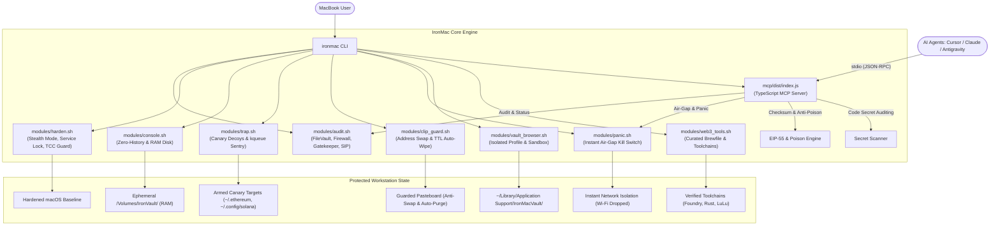

#  IronMac

> **Hardened Web3 & Crypto Workstation for macOS.**  
> Defend against macOS infostealers (AMOS), eliminate plaintext shell history key leaks, deploy active canary honeypots, and isolate high-value transaction signing into auditable clean-room environments.  
>  **Comprehensive Guide:** See the [IronMac User Manual (MANUAL.md)](MANUAL.md) for full operational documentation.

[](LICENSE)
[]()
[]()
[]()
[](https://github.com/0xaicrypto/ironmac/pulls)

---

##  Table of Contents

- [Full User Manual (MANUAL.md)](MANUAL.md)
- [Why IronMac?](#why-ironmac)
- [Threat Model & Security Matrix](#threat-model--security-matrix)
- [Key Features](#key-features)
- [Typical Use Cases & Walkthroughs](#typical-use-cases--walkthroughs)
  - [1. Ephemeral "Burner" Wallets](#1-ephemeral-burner-wallets-airdrops--testnet-testing)
  - [2. Daily Surfing vs. DeFi Signing (Anti-AMOS)](#2-segregating-daily-surfing-from-defi-signing-anti-amos-stealer)
  - [3. Offline Cold Signing for Whales & Multi-Sig](#3-offline-cold-signing-whales--multi-sig-signers)
  - [4. Public Wi-Fi & Conference Hardening](#4-public-wi-fi--crypto-conference-defense)
  - [5. Active Anti-AMOS Honeypot Tripwire](#5-active-anti-amos-honeypot-tripwire-early-warning-alarm)
  - [6. Clipboard Protection & Key Auto-Purge](#6-clipboard-protection--30-second-key-auto-purge)
  - [7. Emergency Air-Gap Panic Protocol](#7-emergency-air-gap-panic-protocol)
- [AI Agent Ecosystem & MCP Integration](#ai-agent-ecosystem--mcp-integration)
  - [1. The AI Agent Threat Model in Web3](#1-the-ai-agent-threat-model-in-web3)
  - [2. Dual Architecture: Guardrail + Autonomous Control Plane](#2-dual-architecture-guardrail--autonomous-control-plane)
  - [3. IronConsole vs. MCP Feature Parity Matrix](#3-ironconsole-vs-mcp-feature-parity-matrix)
  - [4. Model Context Protocol (MCP) Tools Reference](#4-model-context-protocol-mcp-tools-reference)
  - [5. Client Setup (Cursor, Claude Desktop, Antigravity)](#5-client-setup-cursor-claude-desktop-antigravity)
  - [6. Autonomous Agent Workflow Example](#6-autonomous-agent-workflow-example)
- [Vault Browser vs. Vault Console: Key Differences](#architectural-distinction-vault-browser-vs-vault-console)
- [Native macOS MenuBar HUD & Raycast](#native-macos-menubar-hud--raycast)
- [Quick Start & Installation](#quick-start--installation)
- [Command Reference](#command-reference)
- [System Architecture](#system-architecture)
- [Security & Responsible Disclosure](#security--responsible-disclosure)
- [License](#license)

---

##  Why IronMac?

MacBooks are the undisputed hardware of choice for Web3 founders, smart contract engineers, and cryptocurrency traders. However, **default macOS configurations leave critical security vulnerabilities for digital assets**:

- **The Surge of macOS Infostealers (e.g., AMOS / Atomic Stealer):** Malicious `.dmg` and `.pkg` installers (distributed via fake Calendly links, Zoom updates, or compromised job interview tests) systematically harvest browser extension storage (`~/Library/Application Support/...`) to exfiltrate MetaMask, Phantom, and session credentials.
- **Plaintext Terminal History Leaks:** Running `cast wallet import --private-key 0x...`, setting `export PRIVATE_KEY=...`, or generating keypairs permanently commits raw private keys to `~/.zsh_history` in plaintext.
- **Unhardened Network Defaults:** Standard macOS leaves the Application Firewall off, stealth mode disabled, and remote Apple Events available on local networks.
- **Browser Extension Cross-Contamination:** Mixing daily web surfing (social media, untrusted downloads, translation extensions) with high-value DeFi signing exposes wallet extension RPC providers to malicious injection.
- **AI Coding Agent Blind Spots:** Granting AI agents (Cursor, Claude Code, Antigravity) filesystem and shell access exposes private keys if an agent encounters prompt injections in untrusted repositories or malicious npm/pip dependencies.

**IronMac solves these vectors through a 100% open-source, auditable hardening toolkit and intrusion prevention suite that transforms your MacBook into a dedicated crypto fortress.**

---

##  Threat Model & Security Matrix

| Attack Vector / Threat | macOS Default State | IronMac Defense Mechanism |
| :--- | :--- | :--- |
| **AMOS Infostealers** (Fake meeting payloads) | Extension vaults reside in standard hardcoded paths | Physical segregation to `~/Library/.../IronMacVault` + Canary decoys |
| **Shell History Key Harvesting** | Commands logged to disk in `~/.zsh_history` | Ephemeral RAM console with `HISTFILE=/dev/null` (`ironmac console`) |
| **Public Wi-Fi Inbound Probing** | Firewall & Stealth mode disabled | Automated baseline hardening (`socketfilterfw`) |
| **Browser Extension Snooping** | All extensions share browser process privileges | Clean-room browser profile strictly reserved for verified DApps |
| **SSD Artifact Residue** | Private keys and scratch files written to APFS | Volatile 32MB RAM Disk auto-purged on session termination |
| **Background Key Directory Scraping** | Silent unauthorized access to keystores | Zero-CPU `kqueue` tripwire sentry firing immediate desktop alarms |
| **Clipboard Address Substitution** | Any background app can overwrite pasteboard | Real-time address swap detector (`ironmac clip-guard`) |
| **Lingering Private Keys in Clipboard** | Sensitive keys retained in memory indefinitely | 30-second TTL auto-purge for private keys & seed phrases |
| **Accidental Malware / Phishing Execution** | Malware connects outbound to exfiltrate keys | Instant hardware air-gap Panic Button (`ironmac panic`) |
| **AI Agent Prompt Injection & Keystore Scraping** | AI agents with bash access can read keystores and `.env` | Active canary tripwire alarm + RAM disk isolation + Secret scanner |
| **Address Poisoning & LLM Hallucinations** | Agents execute transfers to visually similar or poisoned addresses | EIP-55 checksum & vanity/poison pattern detection MCP tool |
| **Autonomous Agent Runaway / Network Exfiltration** | Rogue or compromised agent executes outbound network calls | Hardware air-gap isolation (`toggle_airgap`) & panic killswitch |

---

##  Key Features

-  **Security Health Audit:** Scans your system's FileVault encryption, SIP, Gatekeeper, Application Firewall, and remote sharing services with an instant risk score.
-  **Automated Baseline Hardening:** One-click enables stealth mode, drops unsolicited ICMP pings, closes unauthenticated ports, and restricts remote automation.
-  **Zero-Trace Vault Console:** Spawns an ephemeral, RAM-backed terminal session (`/Volumes/IronVault`) featuring a cyberpunk telemetry HUD, two-line tactical prompt, and shell history completely disabled (`HISTFILE=/dev/null`). Includes built-in `shred`, `keccak`, `wei2eth`, and offline wallet tooling. All commands and scratch files vanish from memory upon exit.
-  **Built-in EVM & Starknet CLI Wallets:** Instant, zero-trace wallet generation and transaction signing using Foundry's `cast` (EVM) and `starkli` (Starknet) directly inside the ephemeral RAM Disk.
-  **Active Anti-AMOS Honeypot Trap:** Deploys decoy canary keystores in standard infostealer targets (`~/.ethereum/keystore`, `~/.config/solana`, Documents) and runs a zero-CPU `kqueue` sentry daemon that immediately fires audio & desktop alarms when untrusted processes tamper with them.
-  **Clipboard Guard:** Detects silent address swapping trojans (EVM, Solana, Bitcoin) and automatically purges copied private keys and seed phrases after a 30-second TTL.
-  **Emergency Air-Gap Panic Button:** Instant kill switch (`ironmac panic`) that powers off Wi-Fi, purges the clipboard, and shuts down all browsers and communication apps during suspected malware execution.
-  **Isolated "Vault" Browser Profile:** Spawns a hardened, telemetry-free Brave/Chrome profile stored in an isolated directory specifically dedicated to wallet extensions and DeFi transactions.
-  **Native TypeScript Model Context Protocol (MCP) Server:** Exposes a high-performance, type-safe security control plane (`ironmac mcp`) directly to AI coding assistants (Claude Desktop, Cursor, Antigravity, Cline, Windsurf) and autonomous on-chain agents. Agents can query system audit postures, verify crypto address checksums and poison patterns, scan codebases for leaked 64-hex private keys, verify canary tripwires, and trigger emergency network killswitches.
-  **Curated Web3 Toolchain (via Brewfile):** Installs verified developer toolchains (Foundry, Rust, Solana CLI, Docker/OrbStack) and security utilities (LuLu firewall, hardware wallet tools) safely.
-  **Zero-Trust & Zero Binaries:** Every line is written in transparent, clean Shell/TypeScript scripts. No black-box binaries, no telemetry, no tracking.

---

##  Typical Use Cases & Walkthroughs

###  1. Ephemeral "Burner" Wallets (Airdrops & Testnet Testing)
* **The Risk:** Interacting with new testnets, meme tokens, or claiming airdrops often requires generating quick burner keys. Doing this normally leaves raw private keys in text files and permanently logged in `~/.zsh_history`.
* **The IronMac Way:**
  ```bash
  # 1. Spawn a zero-trace memory workspace
  ironmac console

  # 2. Inside the secure console, view built-in commands or live telemetry HUD:
  help   # (or 'iron-help')
  hud    # (live RAM disk, honeypot & air-gap status)

  # 3. Generate an ephemeral EVM burner wallet directly in RAM
  cast wallet new
  # -> Outputs Address, Private Key, Mnemonic directly in RAM
  # -> Automatically displays tactical Key Custody Protocol & safety rules!

  # 4. Or review the comprehensive custody playbook anytime:
  key-guide

  # 5. Or generate a Starknet signer keystore inside the RAM disk
  starkli signer create ./signer.json

  # 6. Perform your testnet claims or transfers, then simply exit:
  exit
  # -> Ephemeral RAM Disk is ejected & erased.
  # -> Zero private keys or commands ever touched your SSD or ~/.zsh_history.
  ```

###  2. Segregating "Daily Surfing" from "DeFi Signing" (Anti-AMOS Stealer)
* **The Risk:** You click a fake Zoom, Calendly, or game-test link on Telegram/Discord. An infostealer (like AMOS) executes and immediately dumps your default Chrome profile where MetaMask or Phantom lives.
* **The IronMac Way:**
  ```bash
  # 1. Initialize your isolated Vault Browser profile
  ironmac vault-browser

  # 2. Launch your clean-room trading browser anytime:
  ironmac-vault-browser
  # -> Runs with an isolated data directory: ~/Library/Application Support/IronMacVault/Profile
  # -> Install only MetaMask/Rabby with zero untrusted extensions
  # -> Complete physical separation from daily web surfing and malicious downloads
  ```

  > [!NOTE]
  > **Will my wallet extensions (MetaMask, Rabby) stay saved?**  
  > **Yes, absolutely.** Unlike the ephemeral Vault Console, the Vault Browser is **persistent**. All installed wallet extensions, custom RPCs, and encrypted keystores are securely stored in your dedicated `~/Library/Application Support/IronMacVault/Profile` directory. You do **NOT** need to re-import your seed phrase every time—simply launch `ironmac-vault-browser` and unlock your wallet with your password as usual.

###  3. Offline Cold Signing (Whales & Multi-Sig Signers)
* **The Risk:** Signing multi-sig transactions or large transfers on an unhardened, internet-connected machine exposes your keys to memory-scraping malware or clipboard address substitution.
* **The IronMac Way:**
  ```bash
  # 1. Launch the zero-trace console
  ironmac console

  # 2. Cut Wi-Fi instantly using the built-in air-gap switch
  airgap on
  # -> Wi-Fi (en0) powered off. System physically isolated.

  # 3. Sign transaction data completely offline
  cast wallet sign --data "0x8f3c..." --interactive
  # -> Generates raw cryptographic signature hex string in RAM

  # 4. Restore Wi-Fi and set RPC to broadcast
  airgap off
  rpc eth
  cast publish <signed_tx_hex>

  # 5. Exit to destroy private key session from memory
  exit
  ```

###  4. Public Wi-Fi & Crypto Conference Defense
* **The Risk:** Airport Wi-Fi and hacker-heavy crypto conferences (Devcon, EthCC, Token2049) are hotbeds for automated port scanning, rogue DNS responder attacks, and local network probes.
* **The IronMac Way:**
  ```bash
  # 1. Audit your current Mac posture in 5 seconds
  ironmac audit

  # 2. Apply stealth baseline (drops ICMP pings, blocks inbound scans, shuts remote ports)
  ironmac harden
  ```

###  5. Active Anti-AMOS Honeypot Tripwire (Early Warning Alarm)
* **The Risk:** A disguised `.pkg` or phishing malware executes in background and starts scanning your system directories for Ethereum keystores or Solana keypairs.
* **The IronMac Way:**
  ```bash
  # 1. Arm canary wallet decoys and start the background kqueue sentry
  ironmac trap start

  # 2. Check armed status and active decoy targets
  ironmac trap status
  # -> ARMED: ~/.ethereum/keystore/UTC--canary-ironmac-trap.json
  # -> ARMED: ~/.config/solana/id.json
  # -> ARMED: ~/Documents/.ironmac_canary/wallet_backup_do_not_share.txt

  # 3. Simulate a test probe to verify desktop alert & alarm sound
  ironmac trap test
  # -> Instant macOS desktop notification: "[ALERT] IronMac Honeypot Triggered!"
  ```

###  6. Clipboard Protection & 30-Second Key Auto-Purge
* **The Risk:** You copy a private key or 12-word seed phrase to import it into a wallet. It remains in your macOS clipboard indefinitely, readable by any background app or telemetry script. Additionally, clipboard malware can swap copied `0x...` addresses with attacker addresses.
* **The IronMac Way:**
  ```bash
  # 1. Start the Clipboard Guard daemon
  ironmac clip-guard start

  # 2. When an EVM, Solana, or BTC address is copied, IronMac verifies integrity.
  # If a rapid address swap occurs, an alarm sounds and the intrusion is logged.

  # 3. When a private key or mnemonic is copied, IronMac initiates a 30-second TTL:
  # -> Desktop alert: "[WARN] Private key detected. Auto-wiping in 30s."
  # -> After 30 seconds: Pasteboard is automatically wiped without human intervention.
  ```

###  7. Emergency Air-Gap Panic Protocol
* **The Risk:** You accidentally ran a suspicious script, opened a fake `.pkg` installer, or suspect an active remote access trojan on your machine.
* **The IronMac Way:**
  ```bash
  # Trigger immediate emergency air-gap
  ironmac panic

  # In < 1 second:
  # -> Powers off Wi-Fi hardware interface (en0)
  # -> Terminates all browsers (Chrome, Brave, Safari) and chat apps (Telegram, Discord, Slack)
  # -> Wipes pasteboard memory to prevent clipboard exfiltration
  # -> Locks the screen

  # When the threat is contained, restore connectivity:
  ironmac panic restore
  ```

---

##  AI Agent Ecosystem & MCP Integration

Modern Web3 developers, quant researchers, and crypto founders increasingly pair-program with AI coding assistants (**Cursor**, **Claude Code**, **Antigravity**, **Cline**) and deploy autonomous on-chain agents (**AI hedge funds, autonomous arbitrage bots, automated liquidators**). 

However, AI agents introduce unprecedented security attack surfaces to macOS workstations. IronMac provides a dual-layer defense matrix and a native **TypeScript Model Context Protocol (MCP)** server to bridge autonomous intelligence with workstation-grade security.

```
       ┌─────────────────────────────────────────────────────────────┐
       │             AI Agent Ecosystem (Cursor / Claude / Antigravity)│
       └──────────────────────────────┬──────────────────────────────┘
                                      │ stdio (JSON-RPC)
                                      ▼
       ┌─────────────────────────────────────────────────────────────┐
       │         IronMac Native TypeScript MCP Server (`ironmac mcp`)  │
       │   [Zero Binary • Type-Safe Zod Schemas • Instant Telemetry]  │
       └───────┬──────────────┬──────────────┬──────────────┬────────┘
               │              │              │              │
       ┌───────▼──────┐┌──────▼──────┐┌──────▼──────┐┌──────▼────────┐
       │  Audit System││Verify Crypto││ Scan Code   ││Hardware Air-Gap│
       │  & Gatekeeper││Address & EIP││ for Private ││ & Emergency   │
       │  Postures    ││55 Checksums ││ Key Leaks   ││ Panic Switch  │
       └──────────────┘└─────────────┘└─────────────┘└───────────────┘
```

---

### 1. The AI Agent Threat Model in Web3

| Vector | Attack Description | IronMac Defense |
| :--- | :--- | :--- |
| **Indirect Prompt Injection** | An untrusted GitHub repository, README, or smart contract audited by an AI agent contains hidden prompts instructing the agent to dump `~/.ethereum/keystore` or `.env`. | **Canary Honeypot Decoys (`ironmac trap`)**: If the agent attempts to read canary files, an immediate alarm sounds and notifies the developer before exfiltration occurs. |
| **Plaintext Key Leaks in Prompts** | Developers paste `.env` files or CLI outputs containing private keys into LLM context windows, sending raw keys to external cloud models. | **In-Memory RAM Console (`ironmac console`)**: Keys generated via `cast wallet new` live exclusively in RAM; `scan_secrets` MCP tool detects exposed keys prior to context ingestion. |
| **Address Poisoning & Vanity Collisions** | LLMs hallucinate similar-looking hex addresses or fall victim to address poisoning attacks where transfer targets are replaced with visually identical vanity hashes. | **EIP-55 Checksum & Poison Validator (`verify_crypto_address`)**: Verifies mixed-case EIP-55 checksums, flags unchecksummed addresses, and detects vanity/zero-address poisoning patterns. |
| **Malicious Package Reconnaissance** | An agent installs a compromised npm or Python package that initiates background socket probes or scans for open ports. | **macOS Stealth Firewall (`ironmac harden`)**: Drops unsolicited ICMP pings, closes unauthenticated ports, and prevents local network probing. |
| **Autonomous Agent Runaway** | An autonomous on-chain trading agent experiences an infinite loop or anomalous network activity. | **Hardware Air-Gap Kill Switch (`toggle_airgap` / `ironmac panic`)**: Programmatic emergency power-off for the hardware network interface (`en0`). |

---

### 2. Dual Architecture: Guardrail + Autonomous Control Plane

IronMac supports two symbiotic modes for AI agents:

#### Dimension A: External Guardrail (Protecting the Mac *from* Coding Agents)
When using agentic coding tools (Cursor Agent, Claude Code, Cline), you grant the AI model bash execution and filesystem read/write privileges:
1. **Canary Tripwire:** IronMac arms realistic decoy keystores in standard infostealer targets (`~/.ethereum/keystore/UTC--canary-ironmac-trap.json`). Any agent tricked by prompt injection into reading or exfiltrating keys trips the `kqueue` sentry, firing an instant siren and desktop banner.
2. **Ephemeral RAM Isolation:** Sensitive private key generation, signing, and secret deployment occur in `/Volumes/IronVault/`, completely isolated from your project workspace and git repository.
3. **Clipboard Key Auto-Wipe:** Copied keys and seed phrases are purged by `ironmac clip-guard` within 30 seconds, preventing background agents from reading lingering clipboard memory.

#### Dimension B: Autonomous Security Control Plane (Empowering Agents *with* IronMac Defenses)
When running or developing autonomous Web3 agents, IronMac provides an official **Model Context Protocol (MCP)** server written in TypeScript. Agents can inspect system security, validate cryptographic recipient addresses, audit generated code for plaintext keys, and isolate network interfaces during high-value signing.

---

### 3. IronConsole vs. MCP Feature Parity Matrix

Every defensive capability and cryptographic tool in IronMac is **100% symmetrically aligned** between human developers inside the secure terminal (`ironmac console`) and autonomous AI agents connecting via stdio (`ironmac mcp`):

| Capability / Domain | IronConsole Terminal Command | AI Agent MCP Tool | Core Protective Value |
| :--- | :--- | :--- | :--- |
| **System Security Audit** | `audit` | `audit_system_security` | Live FileVault, SIP, Firewall, Gatekeeper & SSH posture evaluation |
| **Address Verification & EIP-55** | `verify-address <addr>` | `verify_crypto_address` | True Keccak-256 EIP-55 checksum validation & vanity poisoning detection |
| **Hardware Air-Gap Switch** | `airgap [on\|off\|status]` | `toggle_airgap` | Hardware Wi-Fi (`en0`) isolation switch for clean-room signing |
| **Defensive Telemetry** | `hud` / `status` | `get_defense_telemetry` | Real-time status of canary sentry, clip guard daemon & RAM vaults |
| **Secret Leak Scanner** | `scan-secrets [path]` | `scan_secrets` | Recursively scans files/code for exposed 64-hex keys and sensitive envs |
| **Emergency Threat Panic** | `panic [reason]` | `trigger_emergency_panic` | Instant hardware network drop, clipboard wipe & threat containment |
| **Multi-Chain RPC Hub** | `rpc [eth\|base\|mantle\|...]` | `get_network_rpc` | Curated zero-tracking RPC endpoints (EVM & Solana) |
| **Cryptographic Shredder** | `shred <file>` | `shred_file` | DoD 3-pass CSPRNG random overwrite before unlinking |
| **Keccak-256 Hasher** | `keccak <string>` | `calculate_keccak256` | Offline Keccak-256 hash & 4-byte ERC function selector |
| **Key Custody Playbook** | `key-guide` / `wallet-guide` | `get_custody_playbook` | Operational security rules and forbidden storage vectors |

---

### 4. Model Context Protocol (MCP) Tools Reference

The IronMac MCP server runs over standard `stdio` and exposes 10 high-integrity tools:

#### 1. `audit_system_security`
* **Description:** Runs a live security audit of macOS host defenses.
* **Returns:** JSON object containing `filevault`, `sip`, `firewall`, `gatekeeper`, `ssh_remote_login`, `guest_account`, and overall security `score` (0–100).

#### 2. `verify_crypto_address`
* **Description:** Performs rigorous cryptographic format, true Keccak-256 EIP-55 checksum, and address poisoning validation before transaction execution.
* **Parameters:**
  - `address` (string, required): The recipient address to verify.
  - `expected_chain` (enum: `"evm"` | `"solana"` | `"bitcoin"` | `"auto"`, default: `"auto"`).
* **Security Checks:**
  - **EIP-55 Checksum:** Validates mixed-case capitalization. Flags all-lowercase addresses as warnings and invalid mixed-case as checksum errors. Returns the corrected `checksummed_address`.
  - **Address Poisoning Detection:** Checks for repetitive zero-address patterns (`0x000...000`) and vanity collision patterns.
  - **Solana:** Validates Base58 character set and length (32–44 characters).
  - **Bitcoin:** Validates Legacy (`1...`), P2SH (`3...`), SegWit (`bc1q...`), and Taproot (`bc1p...`) formats.

#### 3. `toggle_airgap`
* **Description:** Enables or disables physical network isolation by toggling the macOS Wi-Fi interface (`en0`).
* **Parameters:**
  - `action` (enum: `"on"` | `"off"` | `"status"` | `"toggle"`, required): `"on"` disables Wi-Fi (air-gapped), `"off"` restores Wi-Fi connectivity.

#### 4. `get_defense_telemetry`
* **Description:** Queries real-time operational status of all active IronMac daemons (`honeypot_sentry`, `clip_guard`, `ram_vault`, `network`).

#### 5. `scan_secrets`
* **Description:** Recursively scans a file or directory for unencrypted private keys, mnemonics, and sensitive environment variables before code is committed or shared.
* **Parameters:**
  - `target_path` (string, required): Absolute or relative path to file or directory to scan.

#### 6. `trigger_emergency_panic`
* **Description:** Programmatically activates the IronMac Emergency Air-Gap protocol.
* **Parameters:**
  - `reason` (string, required): Audit reason or anomaly description triggering the panic.

#### 7. `get_network_rpc`
* **Description:** Resolves curated, privacy-preserving RPC endpoints, chain IDs, and explorers for EVM & Solana networks. Matches the `rpc` hub in `ironconsole`.
* **Parameters:**
  - `network` (enum: `"eth"` | `"sepolia"` | `"base"` | `"mantle"` | `"arb"` | `"op"` | `"polygon"` | `"bsc"` | `"solana"` | `"all"`, default: `"all"`).

#### 8. `shred_file`
* **Description:** Cryptographically overwrites a file with 3 passes of random data before deletion, preventing SSD / RAM forensic recovery. Matches `shred` in `ironconsole`.
* **Parameters:**
  - `file_path` (string, required): Path of the file to cryptographically wipe.

#### 9. `calculate_keccak256`
* **Description:** Computes Keccak-256 hash or 4-byte Ethereum function selector offline. Matches `keccak` in `ironconsole`.
* **Parameters:**
  - `data` (string, required): String or hex data to hash (e.g. `'transfer(address,uint256)'`).
  - `is_hex` (boolean, optional, default: `false`): Whether input data is hex-encoded.

#### 10. `get_custody_playbook`
* **Description:** Returns the tactical Web3 private key custody rules, cold storage procedures, and forbidden persistence vectors. Matches `key-guide` in `ironconsole`.

---

### 5. Client Setup (Cursor, Claude Desktop, Antigravity)

#### Option A: Global CLI Command (Recommended)
If IronMac is installed globally (`curl ... | bash` or symlinked to `~/.local/bin/ironmac`):

##### 1. Claude Desktop
Add to `~/Library/Application Support/Claude/claude_desktop_config.json`:
```json
{
  "mcpServers": {
    "ironmac": {
      "command": "ironmac",
      "args": ["mcp"]
    }
  }
}
```

##### 2. Cursor (Project or User Settings)
Create or edit `.cursor/mcp.json` in your project root, or add in **Cursor Settings > Features > MCP**:
```json
{
  "mcpServers": {
    "ironmac": {
      "command": "ironmac",
      "args": ["mcp"]
    }
  }
}
```

##### 3. Antigravity / Windsurf / Cline
Configure the standard MCP stdio connection:
```json
{
  "mcpServers": {
    "ironmac": {
      "command": "ironmac",
      "args": ["mcp"]
    }
  }
}
```

#### Option B: Direct Node.js Execution
If invoking directly from the cloned repository or bundled build:
```json
{
  "mcpServers": {
    "ironmac": {
      "command": "node",
      "args": ["/Users/YOUR_USER/.ironmac/mcp/dist/index.js"]
    }
  }
}
```

---

### 6. Autonomous Agent Workflow Example

Here is how an autonomous Web3 agent leverages IronMac MCP tools to safely execute an on-chain transfer:

```typescript
// 1. Agent verifies the recipient address format and EIP-55 checksum
const addressCheck = await mcp.callTool("verify_crypto_address", {
  address: "0xd8dA6BF26964aF9D7eEd9e03E53415D37aA96045",
  expected_chain: "evm"
});

if (!addressCheck.valid || addressCheck.checksum !== "valid") {
  throw new Error("Rejected: Invalid or unchecksummed recipient address");
}

// 2. Agent audits local script directory for accidental secret leakage
const secretAudit = await mcp.callTool("scan_secrets", {
  target_path: "./scripts"
});

if (secretAudit.findings.length > 0) {
  throw new Error(`Rejected: Detected plaintext secrets in ${secretAudit.findings[0].file}`);
}

// 3. For ultra-high-value operations, enforce hardware air-gap during offline signing
await mcp.callTool("toggle_airgap", { action: "on" });
// -> Hardware Wi-Fi (en0) powered off; sign transaction offline
await mcp.callTool("toggle_airgap", { action: "off" });
// -> Hardware Wi-Fi restored; broadcast signed transaction to RPC
```

---

##  Architectural Distinction: Vault Browser vs. Vault Console

| Feature | Vault Browser (`ironmac vault-browser`) | Vault Console (`ironmac console`) |
| :--- | :--- | :--- |
| **Data Lifecycle** | **Persistent** (Stored in `~/Library/.../IronMacVault`) | **Ephemeral** (Pure RAM Disk, auto-wiped on exit) |
| **Wallet State** | **Persistent** (MetaMask & accounts stay saved) | **Non-Persistent** (Zero trace, vanishes upon `exit`) |
| **Primary Use Case** | Daily high-value DeFi trading & portfolio management | Burner airdrop claims, testnet testing & offline cold signing |
| **Protection Focus** | Bypasses AMOS stealer paths, prevents extension pollution | Prevents `~/.zsh_history` plaintext key leaks & SSD residue |

---

##  Native macOS MenuBar HUD & Raycast

IronMac pairs CLI-grade security with native macOS desktop ergonomics. You can monitor your fortress status and trigger critical actions without touching a terminal.

```text
       ┌────────────────────────────────────────────────────────┐
       │ [*] IronMac Fortress v0.5.0                            │
       │ ● Active Defenses: ARMED                               │
       │ ────────────────────────────────────────────────────── │
       │ > Launch IronVault Console                         ⌘C   │
       │ > Launch Vault Browser                             ⌘B   │
       │ ────────────────────────────────────────────────────── │
       │ ~ Hardware Air-Gap: ONLINE (Wi-Fi ON)              ⌘A   │
       │ ~ Purge Pasteboard Memory                          ⌘K   │
       │ ? Run Security Health Audit...                         │
       │ ────────────────────────────────────────────────────── │
       │ [!] EMERGENCY AIR-GAP PANIC                        ⌘P   │
       │ ────────────────────────────────────────────────────── │
       │ x Quit IronMac Menu                                ⌘Q   │
       └────────────────────────────────────────────────────────┘
```

### 1. Zero-Overhead Swift MenuBar Companion (`ironmac app`)

Built purely in native Swift Cocoa / AppKit (`NSStatusBar` & `NSMenu`):
- **Zero Dock Clutter:** Uses macOS `.accessory` activation policy—lives exclusively in your top menu bar with no visible Dock icon.
- **Ultra-Lightweight:** Consumes `< 15 MB` RAM and `0.0%` idle CPU (kqueue event-driven with 5s telemetry polling).
- **Instant Hardware Air-Gap:** Toggle Wi-Fi hardware off/on in 1 click via macOS `networksetup`.
- **One-Click Vault Console & Browser:** Instantly launch your ephemeral RAM disk workspace or isolated MetaMask profile.
- **1-Click Pasteboard Purge:** Wipe system clipboard memory clean to prevent key theft.
- **Emergency Panic Button:** Double-confirmation modal triggers immediate network cutoff, clipboard shredding, app termination, and screen lock in `<1s`.

```bash
# Launch MenuBar Companion
ironmac app

# Auto-start on boot (optional)
# Add /opt/homebrew/bin/ironmac-menu (or ~/.ironmac/bin/ironmac-menu)
# to macOS System Settings -> General -> Login Items
```

### 2. Raycast Script Commands (`ironmac raycast`)

If you use [Raycast](https://raycast.com/), IronMac provides 6 native script command integrations with keyboard shortcuts and full telemetry:

| Command | File | Description | Shortcut / Mode |
| :--- | :--- | :--- | :--- |
|  **IronMac HUD** | `ironmac-hud.sh` | Live security telemetry (SIP, FileVault, Firewall, Trap, AirGap) | Inline View |
|  **Air-Gap Switch** | `ironmac-airgap.sh` | 1-click hardware Wi-Fi disconnect / reconnect | Action |
|  **Verify Address** | `ironmac-verify-address.sh` | EIP-55 checksum validation & anti-poisoning analysis | Modal Prompt |
|  **Vault Console** | `ironmac-console.sh` | Spawns zero-trace ephemeral RAM terminal in Terminal.app | Action |
|  **EMERGENCY PANIC** | `ironmac-panic.sh` | High-priority emergency threat cutoff & isolation | Action |
|  **Scan Secrets** | `ironmac-scan-secrets.sh` | Scan workspace/path for leaked private keys, mnemonics, `.env` | File / Folder Target |

**How to Install in Raycast:**
1. Open **Raycast Preferences** (`⌘,`) -> **Extensions** -> **Script Commands**.
2. Click **Add Directories** and select `~/.ironmac/integrations/raycast` (or your local `integrations/raycast` directory).
3. The commands will instantly become searchable in Raycast!

---

##  Quick Start & Installation

### Option 1: Official Homebrew Tap (Recommended for macOS Users)

Install via Homebrew with zero manual path configuration:

```bash
# Tap repository and install
brew tap 0xaicrypto/ironmac
brew install ironmac

# Or via direct one-liner:
brew install 0xaicrypto/ironmac/ironmac
```

After installation, verify your environment:
```bash
ironmac --version
ironmac audit
```

### Option 2: One-Line Guided Install via curl

Run the verified installer directly via curl:

```bash
curl -fsSL https://raw.githubusercontent.com/0xaicrypto/ironmac/main/install.sh | bash
```

> [!TIP]
> **Audit Before Running:** You can inspect the installer code prior to execution by running:  
> `curl -fsSL https://raw.githubusercontent.com/0xaicrypto/ironmac/main/install.sh | less`

### Option 3: Clone and Run Locally

```bash
git clone https://github.com/0xaicrypto/ironmac.git
cd ironmac
chmod +x ./bin/ironmac
./bin/ironmac
```

---

##  Command Reference

```text
=====================================================
            IronMac - Web3 Workstation CLI
=====================================================

Usage: ironmac <command> [options]

Commands:
  audit          Run a comprehensive security audit of your Mac
  harden         Apply recommended security baselines and network stealth
  vault-browser  Launch or configure the isolated Web3 wallet browser profile
  console        Launch a zero-trace, ephemeral RAM-backed secure terminal
  trap           Anti-AMOS honeypot decoys & tripwire sentry [start|stop|status|test]
  clip-guard     Clipboard address swap detector & 30s key auto-wipe [start|stop|status|clear|test]
  panic          Emergency air-gap: instant Wi-Fi shutdown & threat isolation [trigger|restore]
  tools          Interactive installer for curated Web3 developer & trader tools
  mcp            Run Model Context Protocol (MCP) server for AI Agents (Cursor/Claude)
  app            Launch native macOS MenuBar companion HUD (shield in top bar)
  raycast        Install or inspect Raycast script command integrations
  all            Run the complete guided setup wizard
  version        Print IronMac version
  help           Display this help message
```

---

##  System Architecture



---

##  Security & Responsible Disclosure

IronMac adheres to a strict **"Don't Trust, Verify"** philosophy:

1. **No Compiled Binaries:** IronMac core comprises 100% readable, transparent Bash and Python scripts. You can audit every single line.
2. **Non-Destructive Operations:** IronMac does not disable core macOS services (like iCloud or Xcode) and operates strictly within standard user/system boundaries.
3. **Reporting Security Issues:** If you identify any security issue or vulnerability in IronMac, please report it via [GitHub Security Advisories](https://github.com/0xaicrypto/ironmac/security/advisories) or by opening a confidential issue.

---

##  Contributing

Contributions are welcome! Please feel free to submit a Pull Request or open an Issue for new security recommendations, tool integrations, or platform improvements.

---

##  License

Distributed under the [MIT License](LICENSE). Copyright (c) 2026 0xaicrypto.
