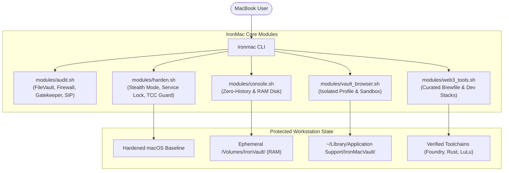

# 🛡️ IronMac

> **Turn your MacBook into an ironclad, audit-ready Web3 & Crypto workstation in minutes.**

[](LICENSE)
[]()
[]()
[]()

---

## 🎯 Why IronMac?

MacBooks are the undisputed hardware of choice for Web3 founders, developers, and crypto traders. However, **default macOS settings leave critical security gaps for crypto assets**:

- **The Rise of macOS Infostealers (e.g., AMOS / Atomic Stealer):** Malicious `.dmg` or `.pkg` files (disguised as fake Calendly links, Zoom updates, or Web3 game tests) silently harvest MetaMask, Phantom, and browser session cookies from `~/Library/Application Support/...`.
- **Plaintext Terminal History Leaks:** Running `cast wallet import --private-key 0x...`, export statements, or mnemonic flags permanently writes your sensitive keys into `~/.zsh_history` in plaintext, which stealers immediately harvest.
- **Unhardened Network Defaults:** Standard macOS often leaves remote login, AirDrop discovery, and local port responses wide open on public Wi-Fi.
- **Shared Browser Pollution:** Mixing daily web browsing (social media, random links, suspicious extensions) with high-value DeFi signing and cold storage bridging is a recipe for disaster.
- **Fragmented Web3 Tooling:** Installing and verifying Foundry, Rust, Solana CLI, Docker, and hardware wallet bridges manually often leads to dependency conflicts or typo-squatted malicious packages.

**IronMac solves this through a 100% auditable, open-source hardening toolkit that transforms your MacBook into a dedicated, fortress-grade crypto workstation.**

---

## ✨ Key Features

- **🔍 Security Health Audit:** Scans your system's FileVault encryption, SIP, Gatekeeper, Application Firewall, and remote sharing services with a clear risk score.
- **🔒 One-Click Baseline Hardening:** Enables stealth mode, closes unauthenticated ports, blocks unverified remote execution, and configures secure DNS-over-HTTPS.
- **💻 Zero-Trace Vault Console:** Launches an ephemeral, RAM-backed terminal session (`/Volumes/IronVault`) with shell history completely disabled (`HISTFILE=/dev/null`). All commands and scratch files disappear from memory upon exit.
- **🪙 Built-in EVM & Starknet CLI Wallets:** Instant, zero-trace wallet generation and transaction signing using Foundry's `cast` (EVM) and `starkli` (Starknet) directly inside the ephemeral RAM Disk.
- **🌐 Isolated "Vault" Browser Profile:** Spawns a hardened, telemetry-free Brave/Chrome profile stored in an isolated directory specifically dedicated to wallet extensions and DeFi transactions.
- **📦 Curated Web3 Stack (via Brewfile):** Installs verified developer toolchains (Foundry, Rust, Solana CLI, Docker/OrbStack) and security utilities (LuLu firewall, hardware wallet tools) safely.
- **💯 Zero-Trust & Zero Binaries:** Every line is written in transparent, clean Shell/Homebrew scripts. No black-box binaries, no telemetry, no tracking.

---

## 🚀 Quick Start

Run IronMac directly via curl (you can inspect the script before running):

```bash
curl -fsSL https://raw.githubusercontent.com/0xaicrypto/ironmac/main/install.sh | bash
```

Or clone and run locally:

```bash
git clone https://github.com/0xaicrypto/ironmac.git
cd ironmac
chmod +x ./bin/ironmac
./bin/ironmac
```

---

## 💻 CLI Usage

```text
=====================================================
            🛡️ IronMac - Web3 Workstation CLI
=====================================================

Usage: ironmac <command> [options]

Commands:
  audit          Run a comprehensive security audit of your Mac
  harden         Apply recommended security baselines and network stealth
  vault-browser  Create an isolated, dedicated Web3 wallet browser profile
  console        Launch a zero-trace, ephemeral RAM-backed secure terminal
  tools          Interactive installer for curated Web3 developer & trader tools
  all            Run the complete interactive setup wizard
  version        Print IronMac version
  help           Display this help message
```

---

## 🏗️ Architecture




---

## 🛡️ Threat Model & Philosophy

1. **Don't Trust, Verify:** IronMac refuses to distribute compiled binaries for core functionality. Everything is auditable in standard Bash/Zsh scripts.
2. **Defense in Depth:** Even if one layer fails (e.g. a phishing link is opened), isolated browser sandboxing and outbound firewall rules prevent credential exfiltration.
3. **Non-Destructive:** IronMac does not break standard macOS features (like iCloud or Xcode) and creates backups of any system configurations it adjusts.

---

## 🤝 Contributing

Contributions are welcome! Please feel free to submit a Pull Request or open an Issue for new security recommendations, tool integrations, or platform improvements.

---

## ⚖️ License

Distributed under the [MIT License](LICENSE). Copyright (c) 2026 0xaicrypto.
